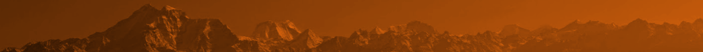

<div class="watermark">DRAFT</div>


```{r setup, include=FALSE}
library(knitr)
library(rgl)
library(rglwidget)
# Basic knitr options
opts_chunk$set(comment = NA, 
               echo = FALSE, 
               warning = FALSE, 
               message = FALSE, 
               error = TRUE, 
               cache = F,
               fig.width = 4,
               fig.height = 3)
knit_hooks$set(webgl = hook_webgl)

knit_engines$set(asis = function(options) {
  if (options$echo && options$eval) knit_child(text = options$code)
})
```

```{r}
library(ggthemes)
library(leaflet)
library(leaflet.extras)
library(sp)
library(raster)
library(ggmap)
library(dplyr)
library(maptools)
library(rgdal)
library(RColorBrewer)
```

# DrOTS Nepal: The Plan {.tabset .tabset-fade} 


```{r, fig.height=2, message=FALSE}
nep0 <- raster::getData(name = 'GADM', download = TRUE, country = 'NPL', level = 0)
nep0_fortified <- broom::tidy(nep0, region = 'NAME_ENGLISH')


nep3 <- raster::getData(name = 'GADM', download = TRUE, country = 'NPL', level = 3)
nep3_fortified <- broom::tidy(nep3, region = 'NAME_3')
```





## Overview

### Summary

The Nepal Drone Observed Therapy System (DrOTS) project will work with the Nepali National Tuberculosis Center (NTC), the Birat Nepal Medical Trust (BNMT), the Nick Simons Institute (NSI), Nepal Flying Labs (NFL) and the World Health Organisation (WHO) to improve TB case detection through active case finding (ACF) of tuberculosis (TB), drone transport of specimens and supplies, and rapid molecular diagnostics, and improve treatment completion through electronic reminders and video
curriculums.


```{r, fig.align='center', fig.height=2}

# Map types we like
maps <- c('Stamen.Watercolor',
          'Stamen.TerrainBackground',
          'Stamen.TonerBackground',
          'Esri.WorldPhysical')
maps <- maps[1]
l <- leaflet(options = leafletOptions(zoomControl = FALSE), width = '100%')

for (i in 1:length(maps)){
  this_map <- maps[i]
  l <- l %>%
    addProviderTiles(this_map, group = this_map)
}


l <- l %>%
    leaflet::fitBounds(lng1 = 40, lng2 = 100,
                       lat1 = 10, lat2 = 50) %>%
  addPolygons(data = nep0,
              fillOpacity = 0.8,
              color = NA,
              weight = 0,
              fillColor = 'darkred') #%>%
    # leaflet.extras::addFullscreenControl() %>%
  # addLayersControl(
  #       baseGroups = maps,
  #       options = layersControlOptions(collapsed = TRUE)
  #   )
l
```


### This document  

This document contains the skeleton of a plan. It is basic, and where it delves into detail it relies heavily on assumption and speculation. It is internal and meant to be suggestive, rather than descriptive, its content subject to inevitable changes based on input from partners. It is divided into four sections.

> **Objectives** covers the main goals of the program, the intermediate deliverables, and a vision for scale-up after the program ends.  

> **Timeline** gives an overview of when each activity is expected to take place.

> **Geography** provides details on two potential locations selected for the project.

> **Roles** covers the respective responsibilities of each partner organization.

> **Budget** gives details on we expect to allot resources.


## Objectives 

### Primary objectives

The objectives of the Nepal DrOTS program are three-fold:

1. Establish an "on-demand" drone service in the mountainous/hilly area, which includes an appropriately equipped and staffed base camp and a cadre of
health workers who are able to request a drone when appropriate, manage the drone and
related technology upon arrival, and launch the drone for its return flight.
2. Remotely Diagnose TB: The same cadre of health workers will be trained to recognize TB
symptoms in people, explain to them the need for testing, and safely obtain quality sputum
samples to be flown via drones for TB diagnosis with rapid molecular diagnostics.
3. Remotely Observe TB Therapy – By combining conventional health provider interaction and
innovative technologies, we will monitor patients during their TB treatment for adverse drug
reactions, ensure medication adherence, and assess trends in symptoms.

### Secondary objectives

Our secondary objectives are (i) to educate and empower local partners to assume full ownership of the DrOTS program, so as to ensure its sustainability after the project ends; and (2) to generate evidence regarding the feasibility, acceptance, and cost-effectiveness of the DrOTS program, with a focusing on informing an eventual scale-up of its services nationwide.  


## Timeline

The DrOTS program will last 30 months and consists of 5 phases:

### Phase 1: Design and planning 

**March 2018 - September 2018** (7 months): 

The "Design and planning" phase - already in progress - consists of two main activities: (i) the identification and establishment of partners and (ii) the detailing of the project's activities and goals. The identification and establishment of partners will entail the following activities:  

- 3 visits by program manager to Nepal (March, May, July), the last one with the Stony Brook GHI DrOTS Project Leader from Madagascar.  
- Detailed preparation of internal planning documents and protocols for standard operating procedures.  
- Communication with partners regarding their roles and responsibilities in the project.  
- Preparation and legal review of the financial plan and budget.  
- Preparation and legal review of a cohesive, unified MOU.  
- Preparation and submission of administrative documents related to GHI's official presence in Nepal, as well as that of the program manager.  
- Preparation and submission of all permissions related to flight.

**Deliverables**:   
```
1. Identification of stakeholders
```
```
2. This document seen, edited, and approved by all stakeholders, and submitted to NSI  
```
```
3. A memorandum of understanding signed by all stakeholders    
```
```
4. Administrative aspects relating to program manager's in-country status (ie, visa / residency permit) and program's status (bank accounts, status as business vs. research project, etc.) approved 
```
```
5. Approval by relevant ministry(ies) to fly; clarification re: line-of-sight vs. autonomous flight
```

### Phase 2: Pilot 

**October 2018 - March 2019** (6 months): 

The "Pilot" phase is intended as a time to ensure that all individual components of the program work at one site: that the drones fly, that the mechanisms for making payments to partners and paying wages in-country work, that the laboratories perform their duties, that are data collection tools are functional, that educational technology (phones+tablets with video curricula) are programmed and deployed, and that our legal status is solid, etc. In other words, all the activities in this phase are geared towards achieving one thing: the production of a Nepal DrOTS Minimal Viable Product (MVP), ie a bare-minimum (but fully working) program at one site.

It is not possible to fully enumerate the activities in this phase, since the process of building the MVP will be iterative, and highly contingent on the successes and failures of prior sub-processes. That said, in a general sense, pilot will require the following activities:  

- Establishment of an in-country presence (office, etc.) by program manager.  
- Purchase of equipment for data collection and information dissemination (tablets and phones). 
- Purchase of laboratory and medical equipment for specimen collection and transport. 
- Purchase of resources (both physical and virtual) for data collection, management, and real-time analysis. - Training of staff involved at each step of the DrOTS process (flying, suspect case identification, laboratory diagnostics, data management).  
- On-the-ground recruitment of partners/champions from local communities.  

**Deliverables**:   

```
1. Acquisition and establishment of an on-site office.
```
```
2. All main roles receiving funding either directly (through employment/grants) or indirectly (through partnership contracts).
```
```
3. Data collection and educational software deployed, tested, re-deployed. 
```
```
4. Successful "full cycle": remote flagging of suspect TB case, drone call, specimen transport, diagnosis, treatment initiation
```
```
5. Write-up of field learnings and "pre-mortem autopsy" (ie, stress points which need to be addressed)
```
```
6. Write-up of SOP / protocol for expansion phase
```


### Phase 3: Expansion 

**April 2019 - December 2019** (9 months): 

The "Expansion" phase is meant to build on the successes and lessons of the "Pilot" phase, and expand from the (one) Pilot site to multiple sites. This will take one of the following three forms:

1. The "wave" model, which seeks to translate the static model of the Pilot into a more dynamic/mobile model (ie, there is not longer one base, but rather a mobile laboratory with mobile teams, making a "wave" across the country to identify and initiate treatment in as many locations as possible).  
2. The "clone" model, which essentially copies the Pilot to other locations, always relying on a basic fieldworker-health post-hospital-lab hierarchy.  
3. The "hybrid" model, which expands to several other laboratory/clinic sites, while also beginning experimentation into mobile laboratories so as to penetrate more hard-to-reach areas.  

The form to be taken in the Expansion phase will be finalized at the end of the Pilot phase, in conjunction with the partners. Regardless of the form, the activities will be similar to the Pilot phase, with one main difference: the program manager will take a more "hands-off" approach, delegating operations to local partners, and focusing on the gathering of data generated by the project (so as to assess its scalability in an organic setting).


**Deliverables**:   
```
1. Local program managers hired at each expansion site OR for each mobile team.
```
```
2. Data standardization and operational protocols understood and enforced for each autonomous team.
```
```
3. Redaction of scale-up grant application.
```
```
4. Major expansion of catchment, services and cases (to be defined in detail during Pilot phase).
```
```
5. Guidelines written, in conjunction with NTC, for national DrOTS program.
```


### Phase 4: Hand-over 

**January 2020 - April 2020** (4 months):  

The "Hand-over" phase is, in fact, a continuation of the Expansion phase, with the focus shifted to empowering local capacity, identifying areas where external support may be needed, acquiring the financing for further expansion, and ensuring local ownership of and engagement with the technological, social, and medical aspects of the program. The purpose of the Hand-over phase is essentially to make the program manager's role irrelevant and ensure that the program is sustainable without outside management or coordination. As the program manager's role is replaced ever more fully by local partners, his/her attention will shift to securing the financing (either through a large grant from a donor such as the Global Fund or through government budgetary commitments) to ensure the program's sustainability, as well as to preparing the data and operational lessons for dissemination.


**Deliverables**:   
```
1. Full hand-over of operations and management to local partners. 
```
```
2. Financial sustainability ensured (either through grant or budget).
```

### Phase 5: Knowledge dissemination 

**May 2020 - August 2020** (4 months):  

The final phase of the project consists of sharing the lessons of the program with the global health community at large. 

**Deliverables**:   
```
1. Academic publications regarding the program's impact and cost-effectiveness  
```
```
2. Open-sourcing of all data which is not private health information, so to allow other researchers to confirm/challenge results.
```
```
3. An online toolkit of program resources and lessons, so as to guide similar endeavors in regards to best practices.
```

## Geography

The program office and Pilot phase will take place in one of the following two areas:

1. Jiri (Dolakha district, Central region)  
2. Beni (Myagdi district, Western region)


```{r}

# NSI hospital
# Or Myagdi (west)?
sites <- data.frame(label = c('Jiri Hospital', 'Myagdi Hospital'),
                   lat = c(27.6249183, 28.3457615),
                   lng = c(86.2091993, 83.5664077))
districts <- c('Dolakha', 'Myagdi') # Jiri
# districts <- 'Solukhumbu' # nothing, but Lukla airport and Phaplu NSI

#BNMT TB reach (page 4)
# http://www.bnmtnepal.org.np/uploads/files/pdf/BNMT%20TB%20REACH%20Year%202.pdf
# districts <- c('Ilam', 'Jhapa', 'Morang', 'Sunsari', 'Saptari', 'Siraha', 'Udayapur',
#                'Dhanusa', 'Mahottari', 'Sarlahi', 'Rautahat', 'Bara', 'Parsa', 'Makwanpur', 'Chitawan')

# # National Tuberculosis Program (Global Fund / Save the Children) of BNMT
# districts <- c('Ilam', 'Jhapa', 'Morang', 'Saptari', 'Sunsari', 'Siraha',  'Udayapur', # eastern
#                'Achham', 'Baitadi', 'Banke', 'Bardiya', 'Dadeldhura', 'Dang', 'Doti', 'Kailali', 'Kanchanpur', 'Pyuthan', 'Rolpa', 'Salyan', 'Surkhet') # western
# NSI hospitals with BNMT cooperation:
# districts <- 'Pyuthan'
# districts <- c('Pyuthan', 'Kapilbastu', 'Bardiya', 'Gulmi')
# districts <- c('Gulmi', 'Kapilbastu', 'Arghakhanchi', 'Pyuthan', 'Salyan', 'Bardiya', 'Achham', 'Doti')
color <- nep3$NAME_3 %in% districts
color <- ifelse(color, 'red', 'grey')
leaflet(nep3, options = leafletOptions(zoomControl = FALSE), width = '100%') %>%
  addPolygons(weight = 1,
              fillOpacity = 0,
              fillColor = NA,
               color = 'black',
               popup = nep3$NAME_3) %>%
  # addPolygons(fillColor = color,
  #             weight = 0,
  #             fillOpacity = 0.7) %>%
    addProviderTiles('Esri.NatGeoWorldMap') %>%
  addPolygons(data = nep3[nep3$NAME_3 %in% districts,],
              fillColor = 'red',
              weight = 0,
              fillOpacity = 0.7,
              popup = ~NAME_3) %>%
  addMarkers(data = sites,
             popup = ~label)
  # leaflet::fitBounds(lng1 = 70, lng2 = 90,
  #                      lat1 = 10, lat2 = 50)

```


There are three reasons why these areas are ideal for the Pilot.

**Reason 1: Proximity to Kathmandu**

Jiri is a 7.5 hour drive from Kathmandu. Beni is an 8.5 hour drive from Kathmandu (or 3 hour drive from Pokhara, which has an airport).

```{r, fig.width = 7}
kathmandu <- data.frame(label = 'Kathmandu',
                        lat = 27.700293,
                        lng = 85.3097815)

places <- bind_rows(kathmandu, sites)

ggplot() +
  geom_polygon(data = nep0_fortified,
               aes(x = long,
                   y = lat,
                   group = group),
               fill = 'pink',
               alpha = 0.2,
               color = 'black',
               size = 0.1) +
  theme_map() +
  geom_point(data = places,
             aes(x = lng,
                 y = lat,
                 color = label),
             size = 3) +
  geom_curve(data = places,
             aes(x = lng[2],
                 y = lat[2],
                 xend = lng[1],
                 yend = lat[1]),
             # lty = 2,
             size = 0.2,
             alpha = 0.4) +
    geom_curve(data = places,
             aes(x = lng[1],
                 y = lat[1],
                 xend = lng[3],
                 yend = lat[3]),
             # lty = 2,
             size = 0.4,
             alpha = 0.4) +
  scale_color_manual(name = '',
                     values = c('darkorange', 'black', 'lightblue')) +
  # coord_map() +
  coord_cartesian()
```

**Reason 2: Hill-mountain blend**

Both districts have mixed terrain: more easily accessible "hill" areas, as well as more remote "mountain" areas. The below shows Dolakha's and Myagdi's elevation profiles (in meters) respectively, as well as Nepal's (with each district's borders marked).


```{r}
# plot(nep3,
#      col = color)
library(nepal)
# plot(nepal::elevation)
# plot(nep3,
#      col = color,
#      add = TRUE)
# text(coordinates(nep3), label = nep3$NAME_3, cex = 0.2)

x <- nep3[nep3$NAME_3 %in% districts,]
dolakha <- nep3[nep3$NAME_3 == 'Dolakha',]
myagdi <- nep3[nep3$NAME_3 == 'Myagdi',]

r_dolakha <- crop(nepal::elevation, extent(dolakha))
r_dolakha <- mask(r_dolakha, dolakha)

r_myagdi <- crop(nepal::elevation, extent(myagdi))
r_myagdi <- mask(r_myagdi, myagdi)

library(RColorBrewer)
cols <- colorRampPalette(brewer.pal(11, "BrBG"))
xx <- nep3[nep3$NAME_3 %in% districts,]
```

```{r, fig.align = 'center', fig.width = 5, fig.height = 5}
plot(r_dolakha,  col = cols(100), main = 'Dolakha')
plot(xx, add = TRUE)
points(places$lng, places$lat, pch = 10)
# text(nepal::cities_sp,  label = nepal::cities_sp$city, cex = 0.7)
```


```{r, fig.align = 'center', fig.width = 5, fig.height = 5}
plot(r_myagdi,  col = cols(100), main = 'Myagdi')
plot(xx, add = TRUE)
points(places$lng, places$lat, pch = 10)
# text(nepal::cities_sp, add = T, label = nepal::cities_sp$city, cex = 0.7)
```


```{r, fig.align = 'center', fig.width = 5, fig.height = 5}
plot(nepal::elevation,main = 'Nepal', col = cols(100))
plot(xx, add = T)
# text(nepal::cities_sp, add = T, label = nepal::cities_sp$city, cex = 0.3, alpha = 0.3)

# plot(nep0, add = T)
```

```{r}

# mfrow3d(nr = 1, nc = 1, sharedMouse = T)  
# rasterVis::plot3D(r)
# rglwidget()
# # par(mfrow = c(2, 2))
# library(rasterVis)
# plot(r)
# plot(nep3, add = T)
# hist(values(r), xlab = 'Meters', main = '')
# rasterVis::contourplot(r)
# par(mfrow = c(1,1))
# y <- raster::extract(x = nepal::elevation, y = x,
#                      fun = function(x, na.rm = TRUE){max(x, na.rm = na.rm)})
```

**Reason 3: NSI connections**

Both Dolakha and Myagdi are districts whose hospitals are part of the NSI's "Rural Staff Support Program" ([link](http://nsi.edu.np/en/page/programs/district_hospital_support_program/rural_staff_support_program_rssp_)).

**Comments on geography**

- Initially, we tried to identify districts with active BNMT supported hospitals and/or laboratories. However, these were all low or medium altitude, in areas where road access is not a major challenge. 
- Jiri (Dolakha) has the additional advantage of being only 2 hours from Charikot district (where Possible's hospital is).
- No final decision has yet been made on geography. These two options are suggestive, not exhaustive. A final decision will be made in conjunction with partner organizations.

## Roles

### Nepali National Tuberculosis Center (NTC)

The NTC will be the primary coordinating organization for the Nepal DrOTS program. In addition to providing technical and medical expertise, the NTC will approve activities, steer the program's strategy, and lead the scale-up phase of the project. 

### Birat Nepal Medical Trust (BNMT)

The BNMT will oversee most operations. Human resources / hiring specific to this project will be made through the BNMT. Materials procurement (geneXpert machines, laboratory supplies, etc.) will also be managed by the BNMT. The BNMT will provide subject area expertise, and work closely with the NTC on strategy and evaluation.

### Nick Simons Institute (NSI)

The NSI's role will be community engagement, worker empowerment and training, incentives management, and technical consulting. Piggy-backing on the connections and experiences from the "Rural Staff Support Program", the NSI will facilitate contacts with the local laboratories and hospitals, assist in the design and deployment of the "community" portion of the project (specifically the role of rural health care workers in their interactions with DrOTS), and help to establish an institutional presence.

### Nepal Flying Labs (NFL) 

NFL will handle all matters related to flight. This covers not only directly-related activities (vehicle procurement, piloting, repairs), but also secondary but pre-requisite activities such as importation duties, legal clearance, government permissions, etc.

### World Health Organisation (WHO)

The WHO will provide technical consulting and guidance, specifically in the Expansion phase.

### Stony Brook University Global Health Institute (GHI)

The GHI will handle coordination between groups, budget issues, research, and evaluation. 


## Budget  

### Overview

The below is a rough approximation of expected expenses:

```{r, fig.width = 8, fig.align = 'center'}
budget <- c('Salaries' = c(240000),
             'Travel\n(international)' = c(10000),
            'Travel\n(national)' = 25000,
             'Laboratory' = c(80000),
             'Dissemination' = 10000,
             'Drones' = 110000,
            'Admin' = 15000)
budget <- data_frame(Category = names(budget),
                     USD = budget)

ggplot(data = budget,
       aes(x = Category,
           y = USD)) +
  geom_bar(stat = 'identity',
           fill = 'darkorange',
           alpha = 0.4) +
  geom_label(aes(label = paste0(USD/1000, 'K'))) +
  theme_fivethirtyeight() +
  labs(title = 'Distribution of 490,000 USD')
```

- **Administration** is meant to cover incidentals related to project logistics: legal fees, internet and utilities, communication, taxes, etc.  
- **Dissemination** will cover publication fees, web hosting, academic conference(s), etc.  
- **Drones** will cover all costs related to flight, including (but not limited to) vehicle acquisition, repairs, piloting, permissions, etc.  
- **Laboratory** will cover all costs related to diagnostics, including (but not limited to) geneXpert machine(s), disposable materials, etc.  
- **Salaries** will cover 2 years of the program manager's salary (50%), as well as local salaries (or salary supplements) for program staff (or partner staff integrated into program) including (but not limited to) medical professionals and fieldworkers, drivers, etc. (but not including salaries for laboratory or drone workers, whose salaries should be covered in their respective budgets).  
- **Travel** includes the program manager's relocation to Nepal (International) and ongoing (National) transportation between Kathmandu, the Pilot site, expansion sites, and the field.   

### Burn rate

The below shows estimated project funds remaining (blue) and spent each month (red). Resource burn rate is expected to be highest in late 2018 and early 2019, due to material acquisition, during the Pilot phase.

```{r, fig.width = 5, fig.align = 'center'}
dates <- seq.Date(from = as.Date('2018-01-01'),
                  to = as.Date('2020-08-01'),
                  by = 'month')
burny <- sin(seq(0, 3, length.out = length(dates)))^2
burny <- burny / sum(burny) * sum(budget$USD)
burn <- data_frame(date = dates,
                   USD = burny) %>%
  mutate(cum = cumsum(USD)) %>%
  mutate(left = sum(budget$USD) - cum)

options(scipen = '999')
ggplot(data = burn,
       aes(x = date,
           y = left)) +
  geom_area(fill = 'lightblue',
            alpha = 0.5,
            color = 'black',
            size = 0.2) +
  geom_bar(stat = 'identity',
           aes(y = USD),
           fill = 'red',
           alpha = 0.5) +
  theme_fivethirtyeight()
```

### Payment contracts

Whenever possible, both for the sake of administrative simplicity as well as local empowerment, the project will hire staff _through_ partner organizations and pay for services, rather than directly hiring staff or providing services. The final MOU will contain dated deliverables/milestones and expectations for each partner organization, as well as the funding amounts to be unlocked upon completion/delivery of milestones. 
