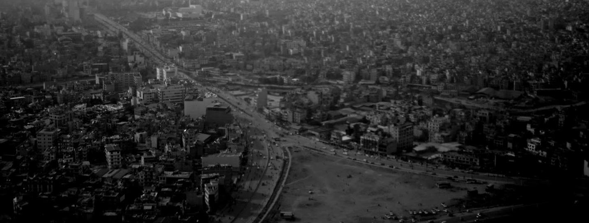
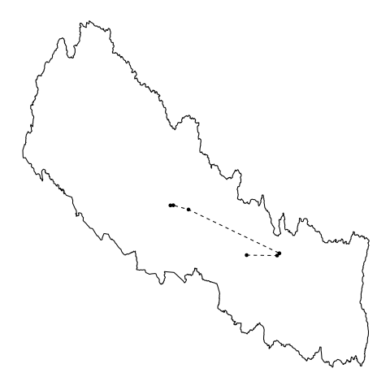

---
output:
  html_document:
    theme: united
    highlight: tango
---


```{r setup, include=FALSE}
library(knitr)
# Basic knitr options
opts_chunk$set(comment = NA, 
               echo = FALSE, 
               warning = FALSE, 
               message = FALSE, 
               error = TRUE, 
               cache = F,
               fig.width = 4,
               fig.height = 3)
knit_engines$set(asis = function(options) {
  if (options$echo && options$eval) knit_child(text = options$code)
})
```

```{r}
library(leaflet)
library(leaflet.extras)
library(sp)
library(raster)
library(ggmap)
library(dplyr)
library(maptools)
library(rgdal)
library(RColorBrewer)

# Dataframe of places we have been

df <- data_frame(
place = c('Kathmandu',
          'Charikot, Bhimeshwor Municipality',
          'Field visit near Charikot',
          'Pokhara, Nepal',
          'Baglung, Nepal',
          'Field visit near Baglung'),
longitude = c(85.32572,
              86.04276,
              86.09603,
              83.9577841,
              83.599637,
              83.53226),
latitude = c(27.67439,
              27.66932,
              27.69682,
              28.2146598,
              28.2650989,
              28.26336))

```

# Nepal, March 2018 {.tabset .tabset-fade} 


```{r, fig.height=2, message=FALSE}
nep0 <- raster::getData(name = 'GADM', download = TRUE, country = 'NPL', level = 0)
nep0_fortified <- broom::tidy(nep0, region = 'NAME_ENGLISH')


nep3 <- raster::getData(name = 'GADM', download = TRUE, country = 'NPL', level = 3)
nep3_fortified <- broom::tidy(nep3, region = 'NAME_3')

nepal_map <- function(data){
  cols <- sample(colorRampPalette(c('darkred', 'grey'))(1000), size = nrow(data), replace = TRUE)
  ggplot(data = data,
       aes(x = long,
           y = lat,
           group = group)) +
  geom_polygon(aes(fill = group), color = NA) +
  ggthemes::theme_map() +
  geom_path(data = df,
            aes(x = longitude,
                y = latitude,
                group = NA),
            lty = 2) +
  geom_point(data = df,
            aes(x = longitude,
                y = latitude,
                group = NA)) +
    scale_fill_manual(name = '',
                      values = cols) +
    theme(legend.position = 'none')
}
if(!'nep.png' %in% dir()){
png('nep.png')
g <- nepal_map(data = nep0_fortified)
g
dev.off()  
}

```


## Overview

### Summary

<p>>We (Peter Small and Joe Brew) spent 10 days in Nepal in March 2018 to identify partners, visit the field, and meet with stakeholders, NGOs, and drone manufacturers. </p>

### Overview

We went to Nepal in early March (Joe: February 28 - March 11; Peter: March 2-10). We traveled with representatives from [Possible](http://possiblehealth.org/) and [Medic Mobile](https://medicmobile.org/) to field sites in Dolakha and Pokhara, respectively (as part of Peter's Rockefeller exploratory trip). We then spent a few days in Kathmandu meeting with various potential partners. The trip was successful in that (a) we made our presence known to the relevant stakeholders, (b) we identified organizations and individuals which are likely to be strong collaborators, and (c) we were able to discuss and begin to narrow down a shared "vision" for rolling out a "Nepal DrOTS franchise".




## Where

### Static map

The below shows a geographic overview of our trip. We arrived at the southernmost point (Kathmandu), drove eastwards to Charikot municaplity (Dolakha district), drove back to Kathmandu, flew westwards to Pokhara, drove to the environs (Baglung district), flew back to Kathmandu, and spent the remainder of the time in the capital.

```{r, fig.align = 'center'}
nepal_map(data = nep3_fortified)
```
<!--  -->


### Interactive map

The below shows the locations of our visit. Click on a marker to see the name of the location.

```{r, fig.align='center', fig.height=5}

# Map types we like
maps <- c('Esri.DeLorme',
          'NASAGIBS.ViirsEarthAtNight2012'
          # 'CartoDB.DarkMatter',
          )
other_maps <- unlist(providers)[grepl('NASA', unlist(providers))]
names(other_maps) <- NULL

other_maps <- other_maps[grepl('Earth|Color', other_maps)]
maps <- c(maps, other_maps)


l <- leaflet(options = leafletOptions(zoomControl = TRUE), width = '100%')

for (i in 1:length(maps)){
  this_map <- maps[i]
  l <- l %>%
    addProviderTiles(this_map, group = this_map)
}


l <- l %>%
  addPolygons(data = nep0,
              fillOpacity = 0,
              color = 'black') %>%
  addMarkers(lat = df$latitude,
                   lng = df$longitude,
                   popup = df$place) %>%
  addPolylines(data = df[c(1,2,3,2,1,4,5,6,5,4,1),], lng = ~longitude, lat = ~latitude, weight = 2, color = 'red') %>%
    # addDrawToolbar(editOptions = editToolbarOptions(
    #     selectedPathOptions = selectedPathOptions())) %>%
    # addMeasurePathToolbar(options =
    #                           measurePathOptions(imperial = TRUE,
    #                                              minPixelDistance = 100,
    #                                              showDistances = FALSE)) %>%
    # addSearchOSM()  %>%
    leaflet.extras::addFullscreenControl() %>%
  addLayersControl(
        baseGroups = maps,
        options = layersControlOptions(collapsed = TRUE)
    )
l
```

## Who

### BNMT

*Birat Nepal Medical Trust*

- Suman Chandra Gurung: scgurung@bnmt.org.np
- Lekha: lekha@bnmt.org.np
- Saki Thapa: saki@bnmt.org.np
- Kritika: kritika@bnmt.org.np

### HERD

*Health Research and Social Development Forum*
(http://www.herdint.com/)

- Dr. Sushil Baral (Director): http://www.herdint.com/teams/memberdetails/category/26
- Sudeepa Khanal (Senior Manager): http://www.herdint.com/teams/memberdetails/category/24 
- Rajeev Dhungel (IT manager): rajeev.dhungel@herdint.com

### Possible

*Possible Health*
(https://possiblehealth.org/)

- Ryan Schwartz (Chief Operating Officer): ryan@possiblehealth.org
- Binod Dangal (Medical Director): binod@possiblehealth.org
- Aradna Thapa (Community Healthcare Director): aradna@possiblehealth.org
- SP Kalaunee (Director of Governance and Partnerships): sp@possiblehealth.org 
- Jess Kribbs (Director of Operations and Procurement): jess@possiblehealth.org

### MM

*Medic Mobil*
(https://medicmobile.org/)

- Sudip Pokhrel (Director of Partnerships for Asia): sudip@medicmobile.org
- Ranju Sharma (Asia Design Lead): ranju@medicmobile.org  
- Shreya Bhatt (Asia Regional Director): shreya@medicmobile.org

### NFL

*WeRobotics/Nepal Flying Labs*
(http://nepal.werobotics.org/)

- Uttam Pudasaini (Coordinator): uttam@werobotics.org 
- Patrick Meier (Head of WR): patrick@werobotics.org(via post-visit phone call)
- Oriol Lopez (Tech guy): oriol@werobotics.org (via post-visit phone call)
- Adam Kaptocz (Tech guy): adam@werobotics.org (via post-visit phone call)

### NTC 

*National Tuberculosis Center*
(We have **NOT** yet met with the below two people, but need to in the next visit)

- Anil Thappa (prevalence survey guy)
- Dr Kadhar K.C.

### MOH

*Ministry of Health*

- Dr. Dipendra (Chief of Public Health Administration and Monitoring and Evaluation Division)
- Dr. Raman Singh: dipendra2028@gmail.com, dipendra_raman@hotmail.com


### WHO

*World Health Organisation*

- Ashish Shrestha (TB Consultant, met separately from others): drshrestha.ashish@gmail.com
- Jos Vandelaer: josvandelaer@gmail.com, vandelaerjo@who.int
- Ruben Samuel: samuelr@who.int
- Anindya Sekhar: bosea@who.int
- Khurshid Alam Hyder (Public Health administrator): hderk@who.int

### NSI

*Nick Simons Institute*
(http://www.nsi.edu.np/en)

- Anil Shrestha (Executive Director): anilsh@nsi.edu.np 
- Bikash Shrestha (Deputy Director): bikash@nsi.edu.np
- Kashim Shah (Senior Program Manager): kashimshah@nsi.edu.np
- Buddha Basnyat (Secretary of NSI executive committee): buddhabasnyat@gmail.com 

### MISC

- Mark Zimmerman: markz@nsi.edu.np 
- Max Caws: mcaws@hotmail.com


## Meetings

### BNMT
    
    - They support govt of Nepal, MOH, especially in TB, HIV/AIDS, MCH, etc.
    		- Very good relationship with MOH, district level, health posts, etc.
    		- Covers 41 districts (of 75)
    		- Putan district (sp): wave 5 grant, active case finding, etc.
    			- Offices in East, West, and Far West, Central
    		- In TB, 3 projects:
    			- GF
    			- EU Impact, Liverpool STMH, KU in Sweden, etc. (implemented in Nepal and Vietnam)
    			- TB Reach (with NSI and govt); BNMT is the implementing partner
    		- Currently focusing on finding missing cases. Difficulty with transporting sputum samples in hard to reach areas
    			- Currently transporting via bike and/or public transportation
    	- New director is positive.
    	- We can start by focusing on sputum transport, if that works well then move to monitors, adherence, reminders, etc.
    	- 
    	- Improve TB finding / adherence
    	- Project addresses 3  core technologies:
    		- drone
    		- video / education
    		- adherence monitoring (everymed for adherence, remote symptom monitors)
    	- Phases
    		- Active case finding
    		- Remote patient treatment
    	- Components to project
    		- A group that works with communities (CHWs, culture, politics, etc.)
    		- TB expert (diagnosis, etc.)
    		- Drone experts (local) - sustainable, generalizable, etc.

### HERD

	- More research focused than BNMT
	- First local NGO to work prominently in TB
	- Recently partnered together for Wave 6 proposal
	- Dr. Sushil Baral
	- IT manager ("big fan of tech innovation")
	- Started as a primary health care provider in mountains on TB
	- Worked in TB control for last 30 years
	- Had been doing community based DOTs vs patient-centered care in 10 mountain districts
		- Engaging family members for support (was infeasible to deliver institutional support)
	- Have not yet tested: what works, for whom, why
	- Previously tried innovation (TB Reach grant 7, mobile van with Genexpert); major challenge is access to lab
		- Of 4,000 health care centers, > 3,000 have no laboratory services
	- There are fantastic diagnostic services, program problems aren't bringing them closer to patients
	- With van projects, identified 10k cases in 2 years.
	- Major concern of NTP is low case detection rate. Not linking presumptive cases with diagnostic facilities.
	- Strategic locations of genexperts
	- Success would mean linking health facility without labs with district hospital with labs
	- Reaching out to vulnerable in hill/mountain + enhancing diagnostic capability is a written priority of govt.
	- HERD has good engagement with NTBCP; 
	- Low confidence in couriers: sputum collection and transportation mechanism - very difficult because (a) burdening the health care provider to send, (b) burden of receiving, (c) motivation
	- BNMT previously had a sputum courier study
	- Very sparse distribution of households requires affordable innovation
	- Strengthen the whole system by starting in one system and then scaling outwards
	- Opportunity with federalism: 753 municipalities calling for help
	- Case finding + case holding = comprehensive system including mobile phones, IT, etc.


### Possible

#### Side meeting with SP

	- Who runs TB services in Dolakha?
		- Dr Binod (Medical Director)
		- ZeroTB initiative
	- Ask about WeRobotics project. 
	- Get an MOU with MoH, and a letter of endorsement for work visa. The MoH recommends to the Ministry of Home Affairs that they issue the visa.
	- MoH technical assistance.
	- For stakeholder's meeting, SP (and maybe Aradna too)
		- HMIS division of MoH Mukti Canal (sp?) should be involved
		- Logistics management division (SP will provide name later on)
	- Make this a ministry "owned" project, but with local implementers
	- If we get involved, we want to be sure that it succeeds.


### MM

#### Side meeting with Sudip

    - Hill country: east is more developed, more open; west is less developed, more challenging
    	- Talk to mayors: he knows 1 or 2 and can intro me
    	- WHO: how are they perceived? under-resourced
    	- Strongest UN actor here is UNICEF
    	- Most respected donor: DFID
    	- USAID: hit or miss
    	- 3 lanes: municipal and national and advocacy (champions: politician, non-state actor like BNMT and HERD, govt)
    
    - Sudip Pokhrel (Director of Partnerships for Asia): sudip@medicmobile.org
    - Ranju Sharma (Asia Design Lead): ranju@medicmobile.org  
    - Shreya Bhatt (Asia Regional Director): shreya@medicmobile.org

### NFL


#### Meeting with Uttam
    
    - 6 different countries: Myanmar, Peru, Mozambique, etc. (disaster response)
    	- Published a report on results of disaster training exercise
    	- 2 current projects: Peru and DRC
    	- He flew at 3800: elevation and cold caused problems. generator and backup needed
    	- Jajarkot where they tried to organize something with SP
    	- Naxa (his company)
    	- Always bring government as consoritum partner for permits reasons
    	- Big challenge: Ministry of Home Affairs (Home Ministry)
    		- They're worried about exploitation and border issues
    		- No challenge from Civil Aviation Authority
    		- Only concerns: aerial routes and height
    	- Forming something like drone association of Nepal
    	- Nepal flying labs: trying to organize stakeholder workshops
    	- Nepal Flying Labs: only goes through December
    	- Have had no problems with importing so far
    	- Peter : Madagascar = 25k per drone, 2 drones, 1 full time technician, 0.5 FTE for regulatory/political
    	- National Disaster Response Center (he gave a presentation a week ago)
    	
#### Call with entire team (after Nepal visit)

    - We agree on a "build as we go" approach: start small and scale up.  
    - We agree that next steps are for Joe to narrow location and weight needs.
    - Tenatively, start flying this fall
    - They'll quickly provide itemized budget as soon as we hone in on site.
    
### NTC 

    No meeting yet. Need to arrange for May.

### MOH

    Not much to report. Mostly formalities / greetings.  


### WHO


#### Side meeting with Ashish Shrestha
    
    - Urban TB is where the biggest issues are.
    	- Minimal reporting coming from private sector, but they're doing most of the work in the urban areas.
    	- Mountain areas have 3x fewer cases reported than lowerlands.
    	- Most NGOs are dealing with service provision, but not focusing on reaching the patients.
    	- Integrate into rapid response / disaster team.
    	- Ask about TB prevalence survey.
    	- A Korean group is doing some compliance work.
    
    	- For TB program, next 5 years:
    		- Only 43 machines right now; after 5 years, 100
    		- Focus right now is on courier system.
    		- In future, all 7 provinces will have a center of excellence.
    		- Right now, country does not have a proper courier system.
    		- Drug resistance is relatively low.
    		- Prevalence survey, everyone is barcoded. Entire application was developed locally.
    	- Interpret - another organization. They have an NGO called CMDN (they are working on the prevalence survey / data collection).


#### Meeting with Jos and team
      
      - Measles blood transport is a challenge; paracetomol is not available in remote hills
      	- Ruben: Emergency (worked with Vayu in India)
      	- Aninda: immunizations
      	- Haida: health systems (background in TB)
      	- Bhutan country office has done some feasibility studies on use of drones
      	- Jos: niche is hard-to-access areas; the risk is that people will depend on last minute drone delivery instead of doing things that humans should do (medical stocking, etc.).
      		- the challenge is to find parts of the health system that humans cannot do (remote areas)
      	- Aninda: hold a workshop and get a 2-day brainstorming session. Get a couple of govt people excited, piggy back on federalization to find the right place, small pilots. In 6 months time, have a case study of what the drone did / did not do.
      	- Jos: in regard to working group. EDP (external development partners) group; AIN (group of NGOs);
      	- EDP group meets every two weeks - we should do a quick presentation. Show what we're doing and start an informal working group.
      	- Nepal Health Research Council (need to get their approval).
      	- Big challenge: federalism - who is going to do what?
      	- Rules: you can't go directly - you have to go through national level before going local. that said, need mayors' buy-in.

### NSI
    
    - Put GeneXpert in 4 hospitals (with BNMT). Flow is very high
    	- Phutan 175 suspected cases examined: 60 = positive
    	- Question: how can we collect sample from high hills?
    	- Anil: we are not involved in this but we can facilitate.
    	- Visas: 
    		- come in as a research fellow with HERD, BNMT, or other INGO
    		- or NTC could help facilitate this by putting them first on the author list
    	Has already collaborated with BNMT. BNMT is doing active case finding.
    	- 4 hospitals: 2 in terai, 2 in hills
    	- Start in the hills, at a NSI hospital. 
    	- NSI's responsibility would be to choose a place

#### Side meeting with Buddha Basnyat 

    
    	- Get Omni GeneXpert for the hills (portable)
    	- For Buddha, it's all about active case finding
    	- Jan 18, active case finding in Vietnam: compared with family contact tracing and not

### MISC

#### Side meeting with Max

  	- 4 districts project
  	- 8 districts TB Reach project wave 5. GeneXpert in 4 of those districts.
  		- Start in Pyuthan district: 3 microscopy centers (not enough) and there is a lot of scattered population
  	- Adherence is not the big problem. The big problem is sample transport.
  	- TBReach is a bit fed up with Nepal.


## Vision

Spending time together and speaking with partners and people on the ground gave us the opportunity to start etching out a very general vision for what the DrOTS Nepal franchise will look like.

#### Time

- Start in late 2018.
- There will be no distinction between "planning", "implementation", and "analysis" phases - all will be simultaneous and iterative.  
- Joe will move to Nepal in late 2018, once all partnerships and bureaucratic formalities have been cleared.

#### Core components 

- We will strive to have as minor an institutional presence as possible.
- Our main task will be to facilitate connections and overcome obstacles by provisioning the necessary funding.  
- Our hired team will likely be a doctor, nurse, tech-person, etc.; to the extent that these hires can be managed by others, this is ideal (assuming we still exercise some degree of control).
- Two competing visions for implementation: (i) wave across the country (ie, elimination campaign) vs. (ii) hunker down in one place, tweak, and learn 
- Empowerment of local organizations and participating individuals needs to be core to program, not an afterthought. This applies to case-finding, adherence, management deliverables, etc.
- 1 primary partner: NTC (main purpose of May meeting)
- 3 kinds of secondary partners: 
  - 1. Drone (WeRobotics / Nepal Flying Labs)
  - 2. TB (policies, geneXpert) (BNMT)
  - 3. Communities (NSI)
  
#### Open questions
- How can we shape this into a Global Fund grant in 2020?
- What are the knowledge products (ie, paper abstracts) we want to generate?
- What is our pitch to NTC in May?
- How can we ensure NSI is a helpful and willing partner without violating the trust of the institution that our work won't be burdensome (ie, provide data/analysis services)?
- Any role for "discarded" partners (Possible, Medic Mobile, HERD, etc.?)

	
	
