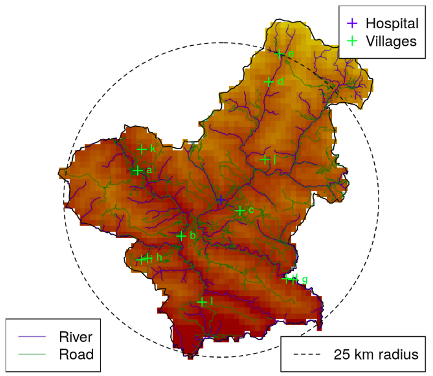
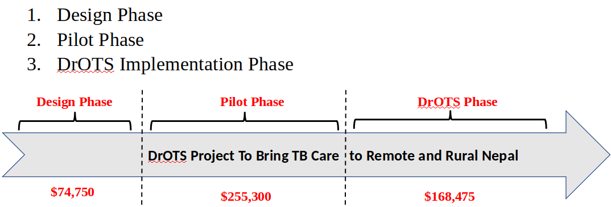
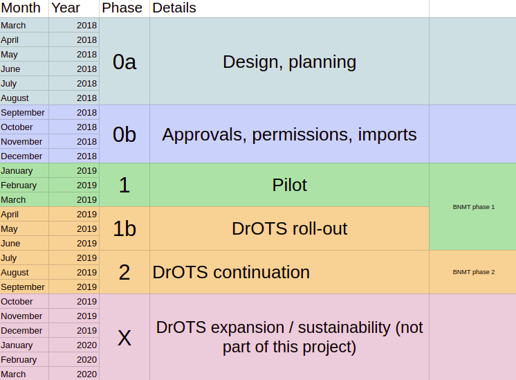

```{r setup, include=FALSE}
library(knitr)
# Basic knitr options
opts_chunk$set(comment = NA, 
               echo = FALSE, 
               warning = FALSE, 
               message = FALSE, 
               error = TRUE, 
               cache = F,
               fig.width = 4,
               fig.height = 3)

knit_engines$set(asis = function(options) {
  if (options$echo && options$eval) knit_child(text = options$code)
})
```

```{r}
library(ggthemes)
library(leaflet)
library(leaflet.extras)
library(sp)
library(raster)
library(ggmap)
library(dplyr)
library(maptools)
library(rgdal)
library(RColorBrewer)
library(googlesheets)

budget <- gs_title('Nepal DrOTS combined budgets')
budget <- gs_read(budget)
```

# DrOTS Nepal: September 2018 Update {.tabset .tabset-fade} 


```{r, fig.height=2, message=FALSE}
nep0 <- raster::getData(name = 'GADM', download = TRUE, country = 'NPL', level = 0)
nep0_fortified <- broom::tidy(nep0, region = 'NAME_ENGLISH')


nep3 <- raster::getData(name = 'GADM', download = TRUE, country = 'NPL', level = 3)
nep3_fortified <- broom::tidy(nep3, region = 'NAME_3')
```


## Overview

### Summary

Given delays in the planning and approvals process, the Nepal Drone Observed Therapy System (DrOTS) project will (a) shift its timeline back and (b) alter the budget allocations slightly, in order to most effectively carry out the aim of working with the Nepali government to improve TB case detection and treatment completion in remote Nepal by bringing diagnosis and treatment directly to the villages.


```{r, fig.align='center', fig.height=2}

# Map types we like
maps <- c('Stamen.Watercolor',
          'Stamen.TerrainBackground',
          'Stamen.TonerBackground',
          'Esri.WorldPhysical')
maps <- maps[1]
l <- leaflet(options = leafletOptions(zoomControl = FALSE), width = '100%')

for (i in 1:length(maps)){
  this_map <- maps[i]
  l <- l %>%
    addProviderTiles(this_map, group = this_map)
}


l <- l %>%
    leaflet::fitBounds(lng1 = 40, lng2 = 100,
                       lat1 = 10, lat2 = 50) %>%
  addPolygons(data = nep0,
              fillOpacity = 0.8,
              color = NA,
              weight = 0,
              fillColor = 'darkred') #%>%
    # leaflet.extras::addFullscreenControl() %>%
  # addLayersControl(
  #       baseGroups = maps,
  #       options = layersControlOptions(collapsed = TRUE)
  #   )
l
```

## Progress so far

- Partners have been confirmed. MOUs should be signed this week.
- Budget and role negotiations have been finalized. 
- Several donations/in-kind contributions have been obtained.
- Protocol has been developed and is under review by ethical committees.
- Landing sites, radio frequencies, and technical specifications have been finalized.
- Flight paths have been planned: http://droneots.com/flight_zone



- Project manager has carried out several planning/negotiation trips over last few months (Kunchok 1; Joe 3).
- Project manager will relocate to rural Nepal (Pyuthan district) in coming weeks, after MOUs are finalized.

## Roles

**The BNMT will:**  

-Oversee the hiring and training of a cadre of CHWs as well as community mobilisers.

-Carry out all ground operations.

-Oversee the procurement of non-UAV materials. 

-Oversee and manage all issues related to laboratory testing and diagnostics. 

-Coordinate with the NTC and MoHP on all medical and clinical issues. 

-Liase with relevant stakeholders to ensure co-ordination with global fund related case finding and ensure no duplication of activities.

-Carry out active case-finding under the BNMT model in the pilot district.

-Integrate drones into the transportation chain in the pilot district.

-Engage with SBU on matters of research and evaluation.


**WR/NFL will:**

-Build engineering foundations for cargo delivery flights in Nepal. 

-Apply for local and national permissions required for autonomous flight (outside of line-of-sight) including, but not limited to, the importation and purchase of vehicles, Ministry (Home, Defense, etc.) approvals, etc.

-Build local capacity for cargo UAV flights by training local Nepali pilots.

-Provide on-demand piloting services for “phase 2” (the 3 month period from April-June 2019).

-Provide on-demand repair/replacement services for “phase 2”.

-Make all data from all flights available to the project partners.

**SBU will:**

-Provide the role of “project manager” and take overall responsibility for the project.

-Fund all necessary and agreed upon activities outside of partners’ normal scope of funded activities.

-Manage and oversee regular coordination meetings between project partners.

-Enact all services and materials procurement contracts with BNMT and WR/NFL.

-Oversee research and evaluation of all project activities.

-Generate knowledge dissemination products for the international research community.

**The NSI will:**

-Review and provide feedback on project operating procedures.

-Monitor and provide feedback on the progress of the project.

-Coordinate with relevant government authorities to facilitate the procedure for bringing in required materials and logistics for project work.

-Provide technical guidance and suggestions when required.


## Timeline changes

The timeline has shifted slightly from its original version in order to accomodate (a) the lengthly administrative approvals process on the health side (ie, IRB, MoH approval), (b) the planning and coordination with partners, and (c) a cumbersome process for the approvals from multiple ministries for flight permissions.

The main consequences of this shift are (i) a prolonging of the "design/planning" phase and (ii) a slight contraction (from 12 to 9 months) of the operational phases.

**Previous timeline**



**New timeline**



## Budget changes

The overall budget remains the same (on the DrOTS side) but has been altered in three ways:

1. Salary costs have gone down slightly (manager works only part-time during non-essential phases, negotiation with partners regarding FTEs).

2. WeRobotics (the drone partner) has agreed to provide $73,388 in in-kind salary contributions (funded through other grants) in order to make the project more robust and provide it more engineering and tech support. EvriMed (South Africa) has agreed to provide all of the "smart" pillboxes for this project free of charge.

3. The distribution of funds to different operational categories has been altered due to (a) negotations with partners, (b) changes in timelines, (c) more detailed costing of project activities and (d) above contributions. Of note, partners are taking on a larger role than originally anticipated (which simplifies project management and keeps all operations as "local" as possible).

### Simple overview

```{r}
budget %>%  mutate(source = ifelse(source == 'SBU', 'DrOTS-Nepal', source)) %>% mutate(jeanne_category = ifelse(jeanne_category == 'Joe salary', 'Manager wages', jeanne_category)) %>% mutate(jeanne_category = ifelse(jeanne_category == 'GeneXpert', 'GeneXpert (+ cartridges, import, shipping)', jeanne_category)) %>% group_by(Funder = source, Recipient = paste0(partner), Category = jeanne_category) %>% summarise(`$` = sum(usd)) %>% kable
```


### Categorical overview

```{r}
budget %>% mutate(source = ifelse(source == 'SBU', 'DrOTS-Nepal', source)) %>% mutate(jeanne_category = ifelse(jeanne_category == 'Joe salary', 'Manager wages', jeanne_category))  %>% group_by(Funder = source, Recipient = paste0(partner), Category = group) %>% summarise(`$` = sum(usd)) %>% kable
```


### Phased categorical overview

Phase 0 is planning/design. Phase 1 is implementation, ground operations and phase-in of air operations. Phase 2 is full air operations.

```{r}
budget %>% mutate(source = ifelse(source == 'SBU', 'DrOTS-Nepal', source)) %>% mutate(jeanne_category = ifelse(jeanne_category == 'Joe salary', 'Manager wages', jeanne_category))  %>% group_by(Phase = phase, Funder = source, Recipient = paste0(partner), Category = group) %>% summarise(`$` = sum(usd)) %>% kable
```


A full, itemized list of the budget is available at www.droneots.com/budget.

## Issues

- Funding installments may need adjustment, given that the start-up costs are far greater than the maintenance costs (ie, greater than 50% of the funding will be spent on things like geneXpert machine, drones, partner HR, etc., prior to achieving the first flights).


